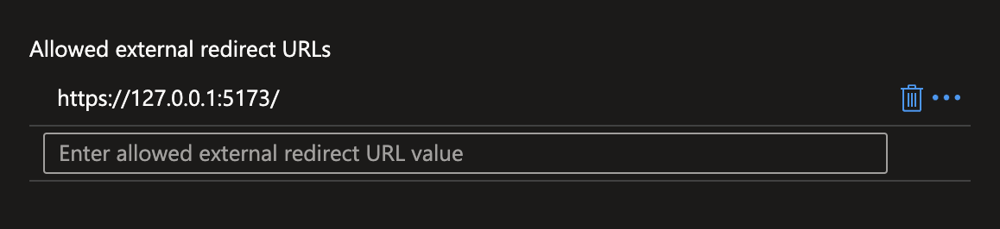
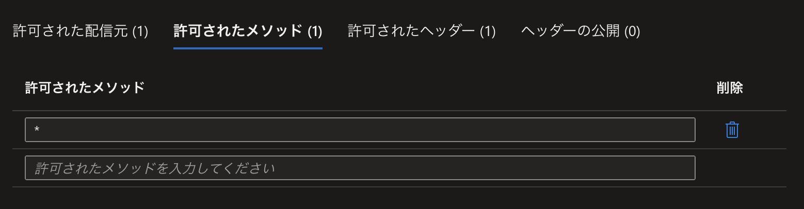

# Play Cloud VOICEVOX

Azure Container Apps で VOICEVOX ENGINE を動作させるサンプルリポジトリ。

## Deploy ENGINE to Azure Container Apps

### Requirements

- Azure Subscription
- Azure CLI
- Terraform 1.6.0+

### Login to Azure

```sh
$ az login
```

### Create Service Principal

以下のページの手順に従って、サービスプリンシパルを作成します。

https://learn.microsoft.com/ja-jp/azure/developer/terraform/get-started-windows-bash?tabs=bash

以下のURLにアクセスし、契約しているサブスクリプションを調べます。
ページに表示されているサブスクリプションIDを控えておきます。

https://portal.azure.com/#view/Microsoft_Azure_Billing/SubscriptionsBladeV2

```sh
$ az ad sp create-for-rbac --role Contributor --scopes /subscriptions/${SUBSCRIPTION_ID}
```

上記コマンドを実行すると、以下のようなJSONが出力されます。

```json
{
  "appId": "xxxxxxxx-xxxx-xxxx-xxxx-xxxxxxxxxxxx",
  "displayName": "some-app-name",
  "password": "~~~~~~",
  "tenant": "yyyyyyyy-yyyy-yyyy-yyyy-yyyyyyyyyyyy"
}
```

### Set Environment Variables

直前のフローで手に入れたJSONを使って、以下のように環境変数を設定します。

```sh
export ARM_SUBSCRIPTION_ID="${SUBSCRIPTION_ID}"
export ARM_TENANT_ID="${tenant}"
export ARM_CLIENT_ID="${appId}"
export ARM_CLIENT_SECRET="${password}"
```

### Deploy

以下のコマンドで Terraform を使用し、デプロイします。

```sh
$ terraform init
$ terraform plan
$ terraform apply
```

成功した後は、Azure Portal で Azure Container Apps が作成されていることを確認します。

### Configure

#### 認証

デプロイされたコンテナアプリを Azure Portal で開き、`認証` のタブを開きます。


`IDプロバイダーを追加` をクリックし、`Microsoft` を選択し、画像のような設定をします。
以下の設定では、現在のサブスクリプションに紐づいた人のみを認証するようになっています。


このままだとデプロイしたコンテナアプリと同一 origin の通信のみ許可になってしまうため、
`許可される外部リダイレクト URL` に利用予定のあるドメインを追加します。
この設定は `認証の設定` の文字列の横の `編集` ボタンをクリックすることで行なえます。



### CORS

Azure Container Apps が備えている認証基盤を通すため、CORS の設定が必要です。
`CORS` のタブを開き、設定します。

今回は簡単のため、すべての origin からのアクセスを許可するように設定します。
実際の運用を行う場合は、適切な設定を行ってください。
値には `*` を指定します。
これは `許可された配信元` と `許可されたメソッド` の両方で行います。
許可されたヘッダー は自動的に設定されるため、設定する必要はありません。



## Deploy VOICEVOX Editor

GitHub Actions を使用して、GitHub Pages に VOICEVOX Editor をデプロイします。

Secrets and variables の Repository secrets に以下の環境変数を設定します。

- `HOST`: Azure Container Apps のアプリケーションURL (例: `https://voicevox-cloud-app.~~~~.japaneast.azurecontainerapps.io`)

Deploy Vite project with GitHub Pages の Action の Run workflow から、手動でデプロイを行います。

## Login with AAD

デプロイされた VOICEVOX Editor にアクセスし、`Login With AAD` をクリックしログインします。

ログイン後は Editor の URL の末尾に `/#/home` を追加し、利用します。

## Notice

不要なリソースは以下のコマンドで削除できます。

```sh
$ terraform destroy
```
